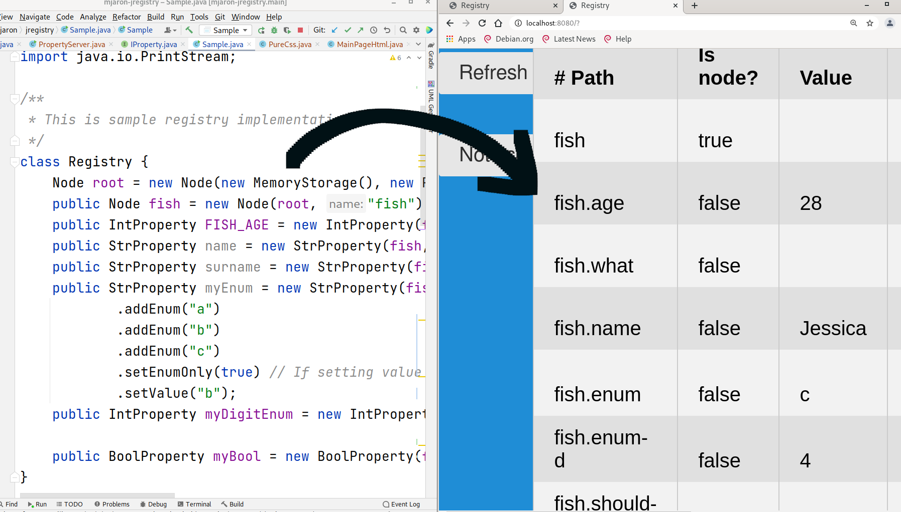

|This is draft only!|
|---|

# mjaron-jregistry

Key-value settings for java (and Android) applications.

The idea is to preview and sometimes modify variables in Java application via web browser.
In future there will be posibility to decide which variable should be persistent and which runtime only.




## Tasks

* [x] String and Integer properties
* [x] Possibility to define default values if properties are not set in storage
* [x] Create type value restrictions (enumerations) 
* [x] Make it thread-safe
* [x] Create transactions with critical section.
* Create persistent storage root
* Create possibility to edit properties via web browser
    * options tree view
    * Create actions which may be triggered with html button
    * Create some options visualizers
    * Add file management

## Demo code

```java
package pl.mjaron.jregistry;

import pl.mjaron.jregistry.core.IPropertyVisitor;
import pl.mjaron.jregistry.core.MemoryStorage;
import pl.mjaron.jregistry.core.ReentrantSection;

import java.io.PrintStream;

/**
 * This is sample registry implementation.
 */
class Registry {
    Node root = new Node(new MemoryStorage(), new ReentrantSection());
    public Node fish = new Node(root, "fish");
    public IntProperty FISH_AGE = new IntProperty(fish, "age").setValue(28);
    public StrProperty name = new StrProperty(fish, "what").setDefault("Fish");
    public StrProperty surname = new StrProperty(fish, "name").setValue("Jessica");
    public StrProperty myEnum = new StrProperty(fish, "enum")
            .addEnum("a")
            .addEnum("b")
            .addEnum("c")
            .setEnumOnly(true) // If setting value other than added enum - a RuntimeException will be thrown.
            .setValue("b");
    public IntProperty myDigitEnum = new IntProperty(fish, "enum-d").setEnumOnly(true).addEnum(4).addEnum(6).addEnum(8);
}

public class Sample {

    static Registry R = new Registry();

    public static void main(String[] args) throws InterruptedException {
        PrintStream o = System.out;
        R.myDigitEnum.setValue(4);
        o.println("All properties:");
        R.root.accept(new IPropertyVisitor.PrintingVisitor());

        R.root.getCriticalSection().withLock(() -> {
            System.out.println("I am secure here!");
            return null;
        });

        Thread thr = new Thread(() -> {
            String someOperationResult = R.FISH_AGE.getCriticalSection().withLock(() -> {
                // All operations inside lock will be called atomically.
                Thread.sleep(10000);
                return R.FISH_AGE.getName();
            });
            System.out.println("someOperationResult: " + someOperationResult);
        });
        thr.start();;

        Thread.sleep(100);
        R.FISH_AGE.getValue();

        o.println();
        o.println("Fish age is: " + R.FISH_AGE.getValue());
    }

}

```
